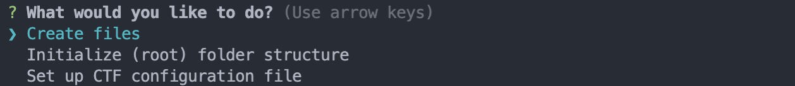
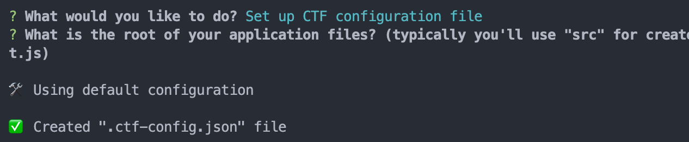
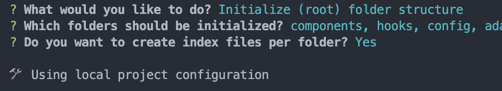
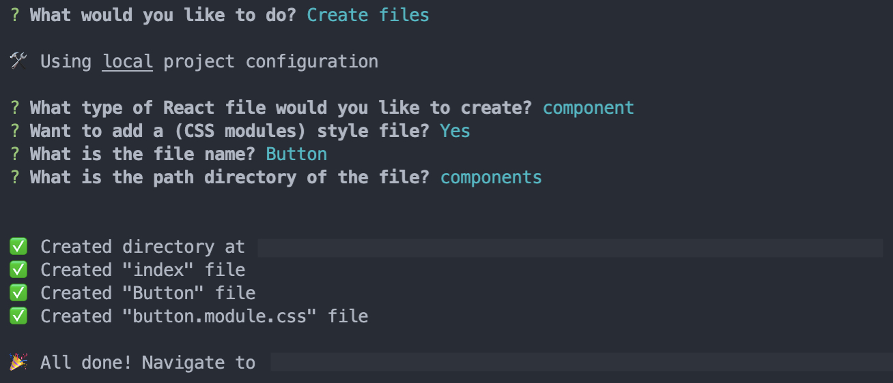

# create-react-typescript-file

### An opinionated, but simple CLI tool to quickly create React Typescript files.

Side-project, loosely based on the excellent work of Josh Comeau's [new-component](https://github.com/joshwcomeau/new-component)

🚧 Under Construction 🚧

## Usage

### Installation

```
# Yarn:
yarn global add create-react-typescript-file

# or NPM:
npm i -g create-react-typescript-file
```

### Usage

Navigate into your project's directory and run:

```
ctf
```

The tool will give you 3 actions:

- Create files
- Initialize (root) folder structure
- Set up CTF configuration file



#### Set up CTF configuration file

By running this action, the tool will create a `.ctf-config.json` file with all defaults and the root you entered.



After this setup, the tool will load up this configuration to get the needed default values per action.

#### Initialize (root) folder structure

This action will quickly setup an entire folder structure for the core parts of your application:

- components
- hooks
- config
- adapters
- helpers
- pages



All of these will be added to the root folder you entered in the configuration action. You can choose to opt out of any of these.

If you've chosen to add an index file per folder, it'll create one within each of those folder with a simple `export {}` that you can update later.

#### Create files



Currently you can add either a component or a hooks file.
When you select a component, you can opt in to create a CSS module file as well. After selecting the name and entering the location (or keeping the default), you'll end up with a new directory that has three files:

```typescript
// Button/index.ts
export { default } from './Button';
```

```typescript
// components/Button/Button.tsx
import React from 'react';
import styles from './button.module.css';

type Props = React.ComponentPropsWithoutRef<'div'> & {};

const Button: React.FunctionComponent<Props> = () => {
  return <div />;
};

export default Button;
```

And an empty CSS modules file

```typescript
// components/Button/button.module.css
```

Creating a hook will give you similar behavior, except that it will not create an index file, but will only create the following:

```typescript
// hooks/useMyHook.ts
const useMyHook = () => {
  return {};
};

export default useMyHook;
```
